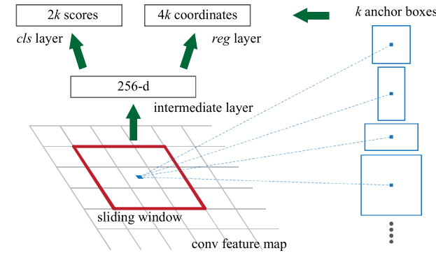

# Faster RCNN
## Env
Images with corresponding bounding box ground truth (center coordinates & width & height)

## Inference Model

### A shared feature extraction for later usage
A convolutional network to extract a feature map, e.g. VGG
### Region Proposal Network
1. One Convolutional layer with output channel 256 and kernel size 3 * 3. **k anchors with different scales and different ratios are centered at every sliding window.**
2. object (positive) / background (negative) **Anchor** classification & bounding box regression
   - Convolutional layer to output probabilities of each anchor centered at this sliding window that it belongs to object and background with output channel 2k and kernel size 1 * 1
   - Convolutional layer to output the offset of the bounding box to each anchor with output channel 2k and kernel size 1 * 1

3. None-maximum suppression (NMS) on proposals: 
   1. Sort all positive anchors according to their cls scores (positive probability)
   2. while not all anchors visited:
      1. Find unvisited anchor $A$ with highest cls score
      2. Delete all anchors whose IOU with anchor $A$ is higher than a threshold (0.7 here)
      3. Mark anchor $A$ as visited
   3. Return top-N ranked anchors

### ROI Pooling
1. Modify N anchors to N bounding boxes according to the result of the bounding box regression
2. For each bounding box:
   1. No matter what shape the original bounding box has, pool this original bounding box to a fixed-size feature map by only accepting the largest value in one patch.
   
   

3. As a result, bounding boxes with different shapes will be pooled to a fixed-size feature map.

### Classfier / Fast RCNN
1. The classifier takes the output of the ROI Pooling as input.
2. Boosting: another bouding box regression is used here to refine the bounding box
3. NMS for all regression

## Inference details
1. Predict objectness for every anchor box. Predict class for every bounding box.
2. Bounding box on original images can be derived from bounding box on feature maps
3. object (positive) / background (negative) classification:
   - The anchor/anchors with the highest Intersection-over- Union (IoU) overlap with a ground-truth box is positive
   - The anchor that has an IoU overlap higher than 0.7 with any ground truth box is positive
   - The anchor with an IoU overlap lower than 0.3 with all ground truth box is negative
   - Anchors that are neither positive nor negative do not contribute to the training objective.
4. cls layer: a binary classification problem with softmax output

## Training: 4-Step Alternating Training
1. Train RPN based on ImageNet-pretraied VGG, so that we have some proposals now.
2. Train Fast RCNN based on proposals from step 1 and ImageNet-pretraied VGG.(RPN and Fast RCNN are not sharing VGG backbones now)
3. Finetune RPN based on **fixed VGG backbones from step 2**
4. Finetune Fast RCNN based on proposals from step 3 and **fixed VGG backbones from step 2**

## Training details
### Train RPN
$$L(\{p_i\},\{t_i\})=\frac{1}{N_{cls}}\sum_i L_{cls}(p_i,p_i^*)+\lambda\frac{1}{N_{reg}}\sum_i p_i^* L_{reg} (t_i,t_i^*)$$
- i: index of an anchor in a mini-batch. Anchors that are neither positive nor negative are not considered here.
- $N_{cls}$: mini-batch size
- $N_{reg}$: the number of anchor locations, i.e. Width of feature map * Height of feature map
- $\lambda=10$
#### $\sum_i L_{cls}(p_i,p_i^*)$
- $p_i$: predicted probability of anchor i being an object.
- $p_i^*$: 1 if the ground truth of this anchor is positive, 0 if negative.
- $L_{cls}$: negative cross entropy loss

#### $\sum_i p_i^* L_{reg} (t_i,t_i^*)$
- only consider bounding box regression loss if $p_i^*=1$, i.e., the anchor is positive
- $t, t^*$:

  
  Problem: This formulation is unconstrained and thus instable.
- $L_{reg}$: [smooth L1 loss](https://pytorch.org/docs/stable/generated/torch.nn.SmoothL1Loss.html), which is more robust

#### Details
- Randomly sample 256 anchors in an image to compute the loss function of a mini-batch, where the sampled positive and negative anchors have a ratio of up to 1:1. Otherwise, it would bias towards negative samples as they are dominate.

# YOLO v1
## Inference Model

1. Resize the input image to 448 * 448
2. Each Inout image is divided into $S*S$ patches
3. Each grid cell predicts $B$ bounding boxes, each bounding box consists of 5 predictions:
  - $(x_i, y_i)$ coordinates represent the center of the box relative to the bounds of the grid cell.
  - $(w_i, h_i)$ are predicted relative to the whole image. Finally
  - Confidence $C_i$: how confident the model is that the box contains an object and also how accurate it thinks the box is that it predicts. Ground truth: $\hat C_i=P(Object)*IOU_{pred}^{gt},\ P(Object)\in\{0,1\}$
3. Each grid cell predicts $C$ conditional class probabilities $P(Class_i|Object)$
4. At test time, $P(Class_i|Object) * P(Object)*IOU_{pred}^{gt}=P(Class_i)*IOU_{pred}^{gt}$ gives us a class-specific confidence scores for each box. These scores encode both the probability of that class appearing in the box and how well the predicted box fits the object.
5. Choose a threshold for confidence. Use NMS to output valid bounding boxes.
## Training

- $\mathbb{I}_{i}^{obj}$: denotes whether object appears in cell i
- $\mathbb{I}_{ij}^{obj}$: denotes whether the jth bounding box predictor in cell i has the highest IOU among all B predictors in that cell
### Bounding box coordinate error
The loss function only penalizes bounding box coordinate error if that predictor is **“responsible” for the ground truth box (i.e. has the highest IOU of any predictor in that grid cell, $\mathbb{I}_{ij}^{obj}=1$)**
#### $\sum_{i=0}^{S^2}\sum_{j=0}^B\mathbb{I}_{ij}^{obj}[(x_i-\hat x_i)^2+(y_i-\hat y_i)^2]$
We parametrize the bounding box x and y coordinates to be offsets of a particular grid cell location (e.g. top left of the **cell**) so they are bounded between 0 and 1.

#### $\sum_{i=0}^{S^2}\sum_{j=0}^B\mathbb{I}_{ij}^{obj}[(\sqrt{w_i}-\sqrt{\hat w_i})^2+(\sqrt{h_i}-\sqrt{\hat h_i})^2]$
We normalize the bounding box width and height by the image width and height so that they fall between 0 and 1.

#### $\sum_{i=0}^{S^2}\sum_{j=0}^B\mathbb{I}_{ij}^{obj}(C_i-\hat C_i)^2$
$C_i$ is the predicted value for ground truth confidence $\hat C_i=\mathbb{I}_i^{obj}*IOU_{pred}^{gt}$ in a specific cell.

#### $\sum_{i=0}^{S^2}\sum_{j=0}^B\mathbb{I}_{ij}^{noobj}(C_i-\hat C_i)^2$

$\hat C_i = 0$
### Classification error
The loss function only penalizes classification error if **an object is present in that grid cell, $\mathbb{I}_i^{obj}=1$**

# YOLO v2
## Difference compared to YOLO v1
1. **Batch normalization** leads to significant improvements in convergence while eliminating the
need for other forms of regularization.
2. High resolution classifier
3. Remove the fully connected layers from YOLO and use anchor boxes to predict dimension offsets of bounding boxes.
   - Use k-means to learn some priors (anchor box dimensions, i.e. width and height) that lead to good IOU. (Assume all bounding boxes are centered at same point)
     - Choose k different centroid dimensions $(W_k,H_k)$
     - For each bounding box, calculate the IOU of it and k centroid bounding boxes with same center $(x_i,y_i)$
     - Choose the centroid with biggest IOU
     - Move average
   - Just like YOLO v1, predicting offsets of a particular grid cell location (e.g. top left of the bounding box) so they are also bounded between 0 and 1.
4. The network still predicts 5 coordinates for each bounding box (bounding box and anchor box have one-to-one correspondence): $t_x, t_y, t_w, t_h, t_o$
   
   - $c_x,c_y$ is the location of filter application (i.e. top left corner of the grid cell)
   - $p_w,p_h$ is a centroid dimension pair from k-means (i.e. anchor box dimensions)
   $$P(Object)*IOU_{pred}^{gt}=\sigma(t_o)$$
5. Concatenate feature maps of different resolutions:
   - Adding a passthrough layer that brings features from an earlier layer at 26 × 26 resolution.
   - Stacking adjacent features into different channels instead of spatial locations, thus turns the 26 × 26 × 512 feature map into a 13 × 13 × 2048 feature map
   - Concatenate with the 13 × 13 feature map
6. Multi-Scale Training: Instead of fixing the input image size we change the net-work every few iterations. Every 10 batches our network randomly chooses a new image dimension size.

# YOLO v3
## Difference compared to YOLO v2
1. Similar as Faster RCNN, YOLOv3 predicts an **objectness score for each bounding box instead of $P(Class_i)*IOU_{pred}^{gt}$** using logistic regression.
   - positive: if the anchor box overlaps a ground truth object by **more than any other anchor box**. Objectness score should be **1** in this case.
   - ignore: if the anchor box is not the best but does overlap a ground truth object by more than some threshold (e.g. 0.5)
   - negative: if the anchor box has a IOU that's smaller than that threshold. Objectness score should be **0** in this case.
2. Class prediction: Instead of using softmax layer for multi-class classification, YOLO v3 uses **binary cross-entropy loss**. This formulation is especially making sense when there are overlapping labels (e.g. Woman and Person).
3. Predictions across scales

   - Similar to feature pyramid networks: Use 3 different scales: 8, 16, 32, smaller feature map for bigger objects.
   - Similar to YOLO v2, use K-means to choose 9 different anchor box dimensions (3 anchor dimensions at each scale, usually larger anchor box for smaller feature map)
   - Why N * N * 255? $255 = 3 * (4 + 1 + 80)$ for 3 box each scale, 4 bounding box offsets, 1 objectness prediction, and 80 class predictions.

# SSD (Single Shot MultiBox Detector)
## Model

1. Evaluate a small set (e.g. 4) of anchor boxes of different **hand-picked** aspect ratios at each location in several feature maps with different scales.
2. Bounding box and anchor box have one-to-one correspondence. For each anchor box, SSD predicts shape offsets and **confidences for all object categories $(c_1,...,c_p)$**
3. During Training: These blue/red anchor boxes are matched with two ground truths (i.e. positive), **all other anchor boxes are negative**. An anchor box is matched with one ground truth if
   - It has the best IOU with this ground truth or
   - It has an IOU higher than a threshold(0.5) with this ground truth

## Training Objectives
$$L(x,c,l,g)=\frac{1}{N}\left(L_{conf}(x,c)+\alpha L_{loc}(x,l,g)\right)$$
- $x_{ij}^p = 1$ if i-th anchor box matches the j-th ground truth box of category p.
- $c$: output of softmax layer
- $l$: predicted box parameters
- $g$: ground truth box parameters

### Confidence loss
$$L_{conf}(x,c)=-\sum_{i\in Pos}^Nlog(c_i^p)-\sum_{i\in Neg}^N\log(c_i^0)$$
- $p$: classification ground truth
- $c_i^p$: predicted probability of anchor $i$ belongs to class $p$
- $p=0$ means there is no object in this anchor. **Background is also a category in SSD**

### Localization loss
$$L_{loc}(x,l,g)=\sum_{i\in Pos}^N\sum_{m\in\{cx,cy,w,h\}}x_{ij}^k smoothL1(l_i^m-\hat g_j^m)$$
details see [Faster RCNN](#Train-RPN)

### Hard Negative Mining
Similar as [Training RPN](#details), there would be a significant imbalance between the positive and negative training examples if we use all negative examples. SSD picks negative examples with highest confidence loss (the network cannot believe it's negative, i.e. hard negative), so that the ratio between the negatives and positives is at most 3:1.

### Data argumentation

# Retina Net
## One-stage vs. Two-stage
- One-stage: applied over a regular, dense sampling of possible object locationss, scales, and aspect ratios. One-stage detectors have the potential to be faster and simpler
- Two-stage: the first stage generates a sparse set of candidate object locations and the second stage classifies each candidate location as one of the foreground classes or as background using a convolutional neural network. Higher accuracy.
## Class imbalance
- **Class imbalance during training** is the main obstacle impeding one-stage detector from achieving state-of-the-art accuracy.
- **Class imbalance is addressed in two-stage detectors** by a two-stage cascade and sampling heuristics.
   - The proposal stage rapidly **narrows down** the
number of candidate object locations to a small number
(e.g., 1-2k), **filtering out most background samples**.
   - In the second classification stage, sampling heuristics, such as a fixed foreground-to-background ratio (1:3), or online hard example mining (OHEM) [31], are performed to maintain a manageable balance between foreground and background.
- **In contrast, a one-stage detector** must process a much larger set of candidate object locations regularly sampled across an image.
  - While similar sampling heuristics may also be applied, they are inefficient as the training procedure is still dominated by easily classified background examples.

## Focal Loss
The Focal Loss is designed to address the one-stage object detection scenario in which there is an extreme im- balance between foreground and background classes during training.
1. Cross Entropy loss: where $p_t$ is the predicted probability of the ground truth class $t$
   $$CE(p_t)=-\log(p_t)$$
2. Balanced Cross Entropy: where $\sum_i\alpha_i=1$. BCE is a common method to balance class imbalance.
   $$BCE(p_t) = -\alpha_t\log(p_t),\ \alpha_t\in[0,1]$$
   While **$\alpha$ balances the importance of positive/negative examples**, it does not differentiate between easy/hard examples.
3. Focal Loss: **balances the importance of easy/hard examples**
   $$FL(p_t) = -\alpha_t(1-p_t)^\gamma\log(p_t)$$
   - When an example is misclassified and $p_t$ is small (hard example), the modulating factor $(1-p_t)^\gamma$ is near 1 and the loss is unaffected. As $p_t\rightarrow 1$ (easier example), $(1-p_t)^\gamma$ goes to 0 and the loss for well-classified examples is down-weighted.
   - The modulating factor $(1-p_t)^\gamma$ reduces the loss contribution from easy examples and extends the range in which an example receives low loss. This in turn increases the importance of correcting misclassified examples.

   

# Drawbacks of anhor boxes
1. We typically need a very large set of anchor boxes, but 
only a tiny fraction of anchor boxes will overlap with ground truth; and this creates a huge imbalance between positive and negative anchor boxes and slows down training.
2. The use of anchor boxes introduces many hyperparameters and design choices. Detection performance is sensitive to the sizes, aspect ratios and number of anchor boxes.
3. The pre-defined anchor boxes also hamper the generalization ability of detectors, as they need to be re-designed on new detection tasks with different object sizes or aspect ratios.
4. Anchor boxes also involve complicated computation such as calculating the intersection-over-union(IoU) scores with ground-truth bounding boxes.
# CornerNet
## Model
The Model detects an object as **a pair of keypoints** —
the top-left corner and bottom-right corner of the bounding box.

The Model predicts
1. two sets of heatmaps to represent the locations of corners of different object categories. 
2. an embedding vector for each detected corner.(serves to group a pair of corners that belong to the same object, the network is trained to predict similar embeddings for them.)
3. offsets to slightly adjust the locations of the corners.

Unlike many other object detectors, the model does not use features from different scales to detect objects of different sizes. the model only applies both modules to the output of the hourglass network.
## Corner Pooling
Corner Pooling does not reduce dimensions.
### Top-left corner

There is often no local visual evidence for the presence of corners. To determine if a pixel is a top-left corner, we need to look horizontally towards the right for the topmost boundary of an object and vertically towards the bottom for the leftmost boundary.

Two feature maps are needed, at each pixel location it maxpools all feature vectors to the right from the first feature map, maxpools all feature vectors directly below from the second feature map, and then adds the two pooled results together.

This can be done in a recursive way:
$$t_{i,j}=\left\{\begin{aligned}\max(f_{t_{ij}}, t_{i+1,j}),\ &\ \text{if }i < H\\ f_{t_{Hj}},\ &\  \text{otherwise}\end{aligned}\right.$$
$$l_{i,j}=\left\{\begin{aligned}\max(f_{l_{ij}}, l_{i,j+1}),\ &\ \text{if }j < W\\ f_{l_{iW}},\ &\  \text{otherwise}\end{aligned}\right.$$
- $t_{i,j}$: first output of corner pooling at location $(i,j)$
- $l_{i,j}$: second output of corner pooling at location $(i,j)$
- $f_{t_{ij}}$: value of first feature map at location $(i,j)$
- $f_{l_{ij}}$: value of second feature map at location $(i,j)$
- $t_{i,j}$ and $l_{i,j}$ need to be added later

### Bottom-right corner
It maxpools all feature vectors between $(0, j)$ and $(i, j)$, and all feature vectors between $(i, 0)$ and $(i, j)$ before adding the pooled results.
## Prediction Module

There is a modified residual block at first.
## Model details
1. Each set of heatmaps has $C$ channels, where $C$ is the number of categories, and is of size $H×W$. There is no background channel. Each channel is a **binary mask** indicating the locations of the corners for a class.
2. For each corner, there is **one ground-truth positive** location, and **all other locations are negative**. During training, instead of equally penalizing negative locations, we **reduce** the penalty given to **negative locations within a radius of the positive location**, which is not so negative and can also produce some resonable bounding boxes. The penalty reduction is given by an unnormalized 2D Gaussian, whose center is at the positive location $(x^*,\ y^*)$. The ground-truth heatmap for class $c$ augmented with the unnormalized Gaussians would be
   $$y_{cij}=\exp\left(-\frac{(x-x^*)^2+(y-y^*)^2}{2\sigma^2}\right),\ \sigma = \frac{1}{3}r,\ (x-x^*)^2 + (y-y^*)^2\leq r^2$$

   - The positive position (center) has $y_{cij}=1$.
   - Positions within a radius of the center is between $[\exp(-4.5), 1]$. The farther from center, the samller $y_{cij}$ is.
   - Positions outside a radius of the center has $y_{cij}=0$.
3. The introduction of downsampling layer maps a location in the image $(x,y)$ to a location in the heatmap $(\lfloor \frac{x}{n} \rfloor, \lfloor \frac{y}{n} \rfloor)$. When we remap the locations from heat maps to input images, there may be some accuracy problem, because CornerNet **predicts a binary mask to represent corners instead of directing predicting the coordinates**. As a result, we need offsets to increase the IOU:
   $$o_k = (\frac{x_k}{n}-\lfloor \frac{x_k}{n} \rfloor,\frac{y_k}{n}-\lfloor \frac{y_k}{n} \rfloor)$$
   
   In particular, only two offset vectors are needed, one is shared for top-left corner and one is shared for bottom-right corner.
4. The actual values of the embeddings (one-dimension) are unimportant. Only the distances between the embeddings are used to group the corners.
## Loss
### Detection Loss
A variant of focal loss:
$$L_{det}=-\frac{1}{N}\sum_{c=1}^C\sum_{i=1}^H\sum_{j=1}^W\left\{\begin{aligned}(1-p_{cij})^\alpha\log(p_{cij})\ \ &, \text{if}\ y_{cij}=1\ \text{i.e. positive}\\ (1-y_{cij})^\beta(p_{cij})^\alpha\log(1-p_{cij})\ \ &, \text{otherwise}\end{aligned}\right .$$
- $p_{cij}$: the score at location $(i,j)$ for class $c$ in the predicted heatmaps
- $y_{cij}$: The ground-truth heatmap for class $c$ augmented with the unnormalized Gaussians
- $N$: the number of objects in am image
- $(1-y_{cij})^\beta$: reduction term. The closer one position is from the center, the smaller $(1-y_{cij})^\beta$ is. For positions outside the zone, $(1-y_{cij})^\beta=1$
- $\alpha=2,\beta=4$
### Offset Loss
$$L_{off}=\frac{1}{N}\sum_{k=1}^N\text{SmoothL1Loss}(o_k,\hat o_k)$$
- $N$: the number of objects in am image

### Embedding Loss
We use the “pull” loss to train the network to group the corners and the “push” loss to separate the corners:
- pull loss
  $$L_{pull}=\frac{1}{N}\sum_{k=1}^N\left[(e_{t_k}-e_k)^2+(e_{b_k}-e_k)^2\right]$$
  - $e_{t_k}$: embedding for the top-left corner of object $k$
  - $e_{b_k}$: embedding for the bottom-right corner of object $k$
  - $e_k$: average of $e_{t_k}$ and $e_{b_k}$
- push loss
  $$L_{push}=\frac{1}{N(N-1)}\sum_{k=1}^N\sum_{j=1,j\neq k}^N\max(0,\Delta-|e_k-e_j|)$$
   - $\Delta=1$: represents the min distance we want

## Why detecting corners would work better than bounding box centers or proposals?
1. The center of a box can be harder to localize because it depends on all 4 sides of the object, whereas locating a corner depends on 2 sides and is thus easier.
2. Corners provide a more efficient way of densely discretizing the space of boxes: Only $O(wh)$ corners are needed to represent $O(w^2h^2)$ anchor boxes.

# FCOS
## Fully Convolutional One-Stage Object Detector
### Terms
- $F_i\in \mathbb{R}^{H\times W\times C}$: feature maps at layer $i$
- $s_i$: stide until layer $i$
- $\{B_i\},\ \text{with}(x_0^{(i)},y_0^{(i)},x_1^{(i)},y_1^{(i)},c^{(i)})\in \mathbb{R}^4\times \{1,2,...,C\}$: ground-truth bounding boxes for an input image
- $(x_0^{(i)},y_0^{(i)})$: coordinates of the left-top corners 
- $(x_1^{(i)},y_1^{(i)})$: coordinates of the right-bottom corners
- $c^{(i)}$: the class that the object in the bounding box belongs to.

