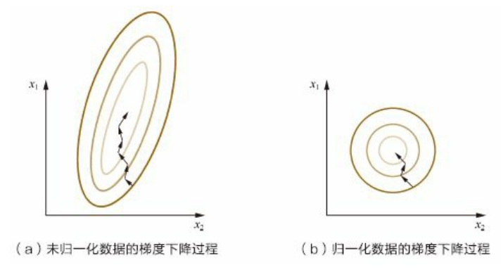
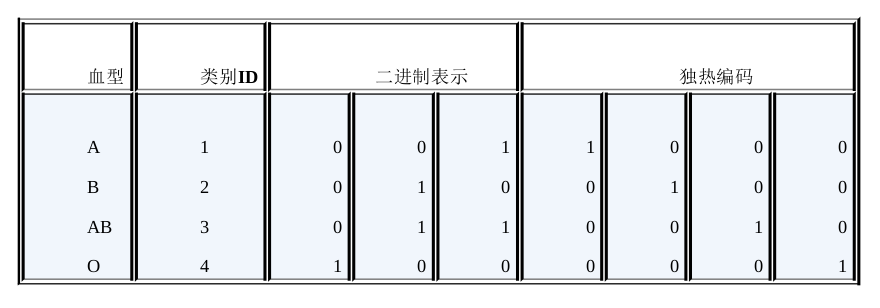

# 为什么需要对数值类型的特征做归一化?
归一化将所有特征统一到一个大致相同的数值区间内。
- 线性函数归一化(MinMax Scaling)
    $$X_{norm} = \frac{X-X_{min}}{X_{max}-X_{min}}$$
- 零均值归一化(Z-Score Normalization):将原始数据映射到均值为0，标准差为1的分布上
    $$X_{norm} = \frac{X-\mu}{\delta}$$

**基于梯度下降的模型通常需要归一化**，但决策树等模型不需要。对于梯度下降来说，归一化可以使得各特征更新速度变得一致，最优解会更快被找到：

# 如何处理类别型特征(Categorical Feature)
- 序号编码： 高-3， 中-2， 低-1。转换后依旧保留大小关系
- 独热编码： A型血-(1,0,0,0)，B型血-(0,1,0,0)，AB型血-(0,0,1,0)，O型血-(0,0,0,1)
  - 可以使用稀疏向量来节省空间，如将`[0,0,1,0,2]`表示为`(5,[2,4],[1,2])`，即长度为5，仅在2 4 索引处有非零元素，分别为1 2
  - 配合特征选择来降低维度
- 二进制编码：先利用序号编码赋予每个类别一个ID，将这个ID的二进制编码作为结果。较独热编码更节省空间。

# 如何处理高维组合特征
- 组合特征是指将离散特征两两组合，如将语言(中文/英文)和类型(电影/电视剧)组合成一个新的特征(中文电影、中文电视剧、英文电影、英文电视剧)。
- 假设特征1(如语言)共m类， 特征2(如类型)共n类。组合特征可以表示为稀疏矩阵$X_{m\times n}$(仅一个参数非零)。如果仅考虑这个组合特征，其逻辑回归模型是$sigmoid\{np.sum(W_{m\times n}\odot X_{m\times n})\}$，即需要学习 $m \times n$ 个参数
- 如果 m, n 均较大，需要将稀疏矩阵$W_{m\times n}$近似为$P_{m\times k}Q_{k\times n}$, k<<m,k<<n。此时逻辑回归模型是$sigmoid\{np.sum((P_{m\times k}Q_{k\times n})\odot X_{m\times n})\}$，即仅需要学习 $m \times k + n\times k$ 个参数。

# 怎样有效地找到组合特征

# 文本表示模型
- 词袋模型：给定若干篇文章，将每篇文章以词为单位切分开。这样每篇文章就可以表示为一个长向量，其中每一维代表一个单词，该维对应的权重则反映了这个词在原文章中的重要程度：
    $$TF-IDF(t,d)=TF(t,d)\times IDF(t)$$
  其中$TF(t,d)$为单词t在文章d中出现的频率，$IDF(t)$表示单词对表达语义的重要性(正比于 文章总数/出现该词的文章数， 即如果一个单词在非常多文章中出现，则可能比较通用，对语义贡献较小)

  但将文章进行单次级别的划分往往不够好，因为将一个短语拆分开后往往会造成较大的含义变化。
- N-gram模型：将连续出现的n个词构成的词组作为一个单独的特征。一般会对单词进行词干提取
- 主题模型
- 词嵌入模型(如Word2Vec)

# 图像数据不足时的处理方法
训练数据不足容易导致过拟合，可以通过基于模型和基于数据的方法降低过拟合风险
- 基于模型：简化模型、添加正则化、集成学习(Model Ensemble)、Dropout
- 基于数据：Data Augmentation(旋转，平移，缩放，添加噪声，颜色变换)，使用生成模型
- 迁移学习