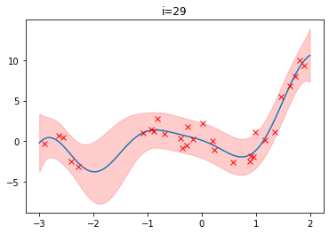

# 准确率的局限性
$$Accuracy = \frac{n_{correct}}{n_{total}}$$
当不同类别的样本比例非常不均衡时，占比大的类别往往成为影响准确率最主要的因素。如果正样本占比为99%，只要永远预测为正，则准确率可达99%。为解决这一问题可以使用更为有效的平均准确率(每个类别下的样本准确率的算术平均)。

# 精确率 vs. 召回率
- 精确率：$P=TP / (TP+FP)$，保守精确率更高
- 召回率：$R=TP / (TP+FN)$，激进召回率更高
- T/F：分类正确与否， P/N：分类器认为是正/负样本
- $F1=\frac{2PR}{P+R}$

# RMSE的意外
- 尽管RMSE都很高，但实际上在95%的情况下相对误差较小是为什么？
- $RMSE=\sqrt{\frac{1}{n}\sum_{i=1}^N(y_i-\hat y_i)^2}$，因此如果存在个别偏离程度非常大的离群点，也会导致RMSE指标变差
- 可以通过在数据预处理阶段去除outlier或使用$MAPE=\sum_{i=1}^N\frac{1}{n}|\frac{y_i-\hat y_i}{y_i}|$来降低outlier的影响。

# ROC曲线，AUC(Area under curve)
- ROC横坐标为假阳性率$FPR=\frac{FP}{N}$
- ROC纵坐标为真阳性率$TPR=\frac{TP}{P}$
- 假设10位疑似癌症患者，3位确实罹患癌症(P=3),7位正常(N=7)，医院诊断出4位患者，但其中仅2位真的罹患癌症，则$FPR=\frac{2}{7}, TPR=\frac{2}{3}$
- ROC曲线的绘制：因为模型的输出一般都是预测样本为正例的概率，所以需要一个概率阈值来进行分割。通过动态地调整阈值，可以绘制ROC曲线。
- AUC指ROC曲线下的面积大小。AUC越大，说明分类器越可能把真正的正样本排在前面。
- 正负样本的分布发生变化时，ROC曲线形状基本保持不变，但P-R曲线形状一般会发生较剧烈的变化。

# 余弦相似度
- 对于向量而言，余弦相似度指两个向量夹角的余弦
  $$cos(a,b) = \frac{a\cdot b}{||a||_2||b||_2}$$
- 对于张量，需要指定某一维度，将沿这一维度计算余弦相似度，输出的形状相当于输入的形状减去那一维度。
- 余弦相似度在**高维**情况下依然可以保持“相同时为1，正交时为0，相反时为-1”的性质。

# 余弦距离
$$dist(a,b) = 1-cos(a,b)$$
- 余弦距离**不是**一个严格定义的距离，因为它不完全满足距离的性质
  - 正定性，满足：$dist(A,B)\geq0$恒成立
  - 对称性，满足：$dist(A,B)=dist(B,A)$
  - 三角不等式，不满足：$dist(A,B)+dist(B,C)\geqdist(A,C)$不恒成立

# 什么是A/B测试
- 线上A/B测试是指将用户分为实验组和对照组。对实验组使用新模型，对对照组使用旧模型。通过比较确定新旧模型哪个更受欢迎。
- 注意分桶过程随机，无偏

# 为什么在充分的离线评估之后还需要进行A/B测试？
- 离线评估无法完全消除模型过拟合的影响
- 离线评估往往是理想工程环境下的结果
- 离线评估关注的是模型指标，如ROC等，但线上评估关注的是商业指标。二者不完全等价。

# 模型评估方法
- Holdout：将原始样本集合随机划分成训练集和验证集两部分。但缺点是验证集上计算出来的最后评估指标与原始分组有很大关系。
- k-fold交叉验证：将全部样本划分成k个大小相等的样本子集。共评估k次，每次把k-1个子集作为训练集，剩余的1个子集作为验证集。
- bootstrapping：对于总数为n的样本集合，进行n次**有放回**的随机抽样，得到大小为n的训练集。将从没有被抽样的样本作为验证集。

# 如果$n\rightarrow\infty$，验证集占比多少
- n次未被抽中的概率为$(1-\frac{1}{n})^n$
- $\lim_{n\rightarrow\infty}(1+\frac{1}{n})^n=e$
    $$(1-\frac{1}{n})^n=\frac{1}{(1+\frac{1}{n-1})^{n-1}}\cdot \frac{1}{(1+\frac{1}{n-1})}$$

- $\lim_{n\rightarrow\infty}(1-\frac{1}{n})^n=\frac{1}{e}=0.368$
- 大约有36.8%的样本从未被选择

# 超参数调优
超参调优的目的是找到一组超参，使得目标函数的值全局最优，而不可以简单地理解为找到能converge的超参。
- 网格搜索：现使用较广的搜索范围和较大的步长，来寻找全局最优值可能的位置。然后逐步缩小搜索范围和步长，来寻找更精确的最优值。但由于目标函数一般是非凸的，所以很可能错过全局最优值。
- 随机搜索：随机取样本点，不遍历整个超参数空间
- 贝叶斯优化算法：利用之前采样的信息辅助调参过程
  1. 选用超参进行训练，并将超参和训练的最优解成对记录下来
  2. 用高斯过程描述最优解与超参的关系
  3. 使用某个搜索函数(如lower bound function$\mu_{y^*}-\sigma_{y^*}$)查找当前最优超参$\underline x^*$，使得该搜索函数最小
  4. return to 1，直到满意

注：高斯过程假设对于函数$f(x)$而言，任何若干个$\underline x$组成的集合$\underline X$对应的$f(x)$取值组成的多维向量$\underline t = [f(\underline x_1),...f(\underline x_i),...]$满足高斯分布。
    
$$p(\underline t|\underline X)=\mathcal{N}(\underline t|\underline 0, \underline K), \text{ with\ } \underline K=[k(\underline x_i,\underline x_j)]$$
($k$可为Gaussian kernel)

而回归值$y$又满足
$$p(\underline y|\underline X) = \mathcal{N}(\underline y|\underline t, \sigma_y^2\underline I)$$

这样通过给定的训练集($\underline X,\underline y$)，预测出测试点$x^*$处回归值$y^*$的期望与方差$p(y^*|\underline x^*,\underline X,\underline y)=\mathcal{N}(\mu_{y^*},\sigma^2_{y^*})$

# 预防过拟合
- 更多的训练数据
- 降低模型复杂度
- 正则化方法
- 集成学习，如Bagging

## 预防欠拟合
- 添加新特征
- 增加模型复杂度
- 减小正则化系数
