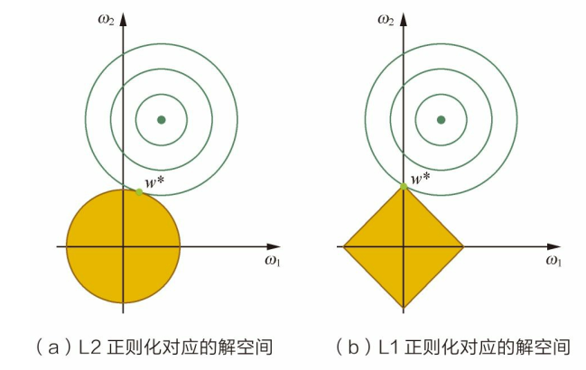

# 有监督学习的损失函数
- 对于二分类问题, $y\in\{1,-1\}, y_i = sign(f_i)$：
  - 0-1损失：$L_{0-1}(f,y)=1_{fy\leq0}$
  - Hinge损失:$L_{hinge}(f,y)=\max\{0,1-fy\}$
  - cross entropy: $L_{cross\ entropy}(f,y)=-\log_2(\frac{1+fy}{2})$
  - cross entropy for $y\in\{0,1\}, p=sigmoid(f)$: $L_{cross\ entropy}(p,y)=-(y\log p+(1-y)\log (1-p))$
- 对于回归问题：
  - L1: $L_1(f,y)=|f-y|$ 更鲁棒一些
  - L2: $L_2(f,y)=(f-y)^2$ 预测值距离真实值越远时。惩罚力度越大
  - Huber: $|f-y|$较小时为平方损失，较大时为线性损失

# 凸优化
- 凸函数：凸函数曲面上任意两点连接而成的线段上的任意一点都不会处在该函数曲面的下方
- 凸函数满足 黑森矩阵半正定
- 凸函数所有的局部极小值都是全局极小值

# 无约束优化算法
- 直接法：直接求解$\nabla L(\theta^*)=0$
  - 岭回归 Ridge Regression：部分问题可直接求解:
  $$L(\theta)=||\underline X\underline \theta-\underline y||^2+\lambda||\theta||^2\\=(\underline X\underline \theta-\underline y)^T(\underline X\underline \theta-\underline y)+\lambda\underline\theta^T\underline\theta\\=\underline \theta^T\underline X^T\underline X\underline \theta-2\underline y^T\underline X\underline \theta+\underline y^T\underline y+\lambda\underline \theta^T\underline \theta$$
  $$\nabla_\theta(L)=2\underline X^T\underline X\underline\theta-2\underline X^T\underline y+2\lambda\underline \theta=0$$
  $$\Rightarrow \underline\theta^*=(\underline X^T\underline X+\lambda\underline I)^{-1}\underline X^T\underline y$$
- 迭代法：求解 $\delta_t=\argmin_\delta L(\theta_t,\delta)$
  - 一阶迭代: $\theta_{t+1}=\theta_t-\alpha\nabla L(\theta_t)$
  - 二阶迭代: $\theta_{t+1}=\theta_t-\nabla^2L(\theta_t)^{-1}\nabla L(\theta_t)$

# 梯度验证
- 梯度的数学定义:
  $$\frac{\partial L(\underline\theta)}{\partial \theta_i}=\lim_{h\rightarrow0}\frac{L(\underline \theta+h\underline e_i)-L(\underline \theta-h\underline e_i)}{2h}$$
- 使用其他方法计算出的梯度应该与它类似。

# 随机梯度下降法
- 经典梯度下降，计算量过大
$$\nabla L(\theta)=\frac{1}{M}\sum_{i=1}^M\nabla L(f(x_i,\theta),y_i)$$
- 随机梯度下降，用单个训练样本的损失来近似平均损失
- mini-batch：
$$\nabla L(\theta)=\frac{1}{m}\sum_{j=1}^m\nabla L(f(x_{i_j},\theta),y_{i_j})$$

# 随机梯度下降法的加速
- 随机梯度下降类似于摸着石头下山
- 动量方法：在有阻力($\gamma$)的情况下保持惯性
$$v_t=\gamma v_{t-1}+\eta g_t,\ \theta_{t+1}=\theta_t-v_t$$
- AdaGrad方法：依靠前几次迈步的感觉，对周围环境进行感知。更新频率**低**的参数(方向)可以有**较大**的更新步幅
$$\theta_{t+1,i}=\theta_{t,i}-\frac{\eta}{\sqrt{\sum_{k=0}^tg_{k,i}^2+\epsilon}}g_{i,j}$$
- Adam方法：综合保持惯性和环境感知

# L1正则化与稀疏性
- 稀疏性：指模型的很多参数为0，只留下比较重要的特征，提高模型的泛化能力
- 为什么L1正则化使得模型参数具有稀疏性？
  - 角度1：解空间形状
    

    含L1正则化的目标函数
    $$L(f(\theta,x_i), y_i) = (y_1-f(\theta,x_i))^2+\lambda|\theta|$$
    可以看作一个有约束优化问题的拉格朗日函数。而其约束的形状正是一个正方形。与L2正则化相比，L1正则化更容易在尖角处与MSE loss的等高线碰撞出稀疏解。
  - 函数叠加
      

      L1正则项$C|\theta|$的导数在原点左右两边分别是$-C,C$，而L2在原点附近导数极小。因此在原点左侧，L1比L2更倾向于递减；在原点右侧，L1比L2更倾向于递增。
  - 贝叶斯先验