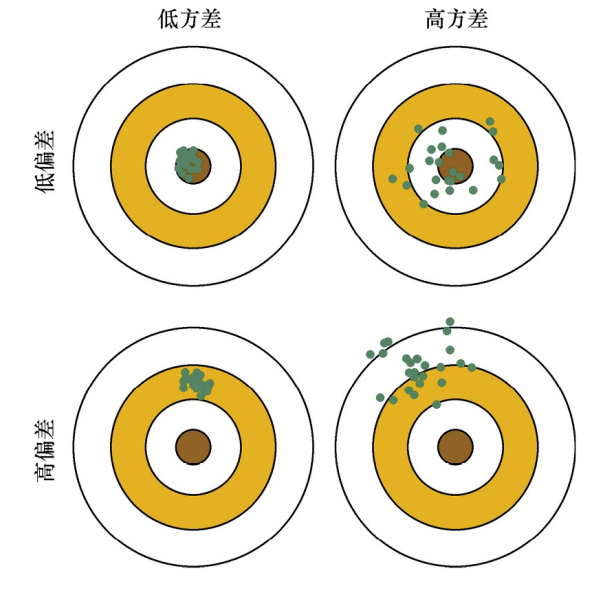
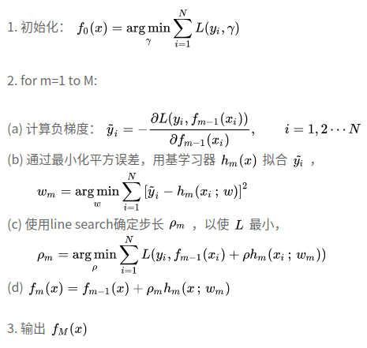

# 集成学习分哪几种？他们有何异同？
- Boosting：串行，各个基分类器之间有依赖，learn from your mistakes。
  - 将各个基分类器层层叠加，每一层在训练的时候，对前一层基分类器分错的样本给予更高的权重。
  - 测试时，对各层分类器的结果加权得到最终结果。
  - Boosting类似人类学习的过程：第一遍学习时记住一部分，第二遍学习时针对犯过的错误加强学习，以减少类似错误的发生，并不断循环往复。
  - Boosting降低了**偏差**
- Bagging：并行训练，各个基分类器之间无强依赖
  - 将训练集分为各个子集(当训练样本数量较少时，子集之间可能有交叠)
  - 在最终决策时，通过投票的方式权衡多个基分类器的结果。保证集成后的分类器的方差比基分类器的**方差**小
  - 随机森林法就是一种Bagging

# 集成学习的基本步骤
- 找到误差相互独立的基分类器
- 训练基分类器
- 合并基分类器的结果
  - 合并方法包含简单的voting或者
  - stacking：将所有基分类器的结果按顺序stack成一个向量。使用一个新的融合模型(如logistic regression)进行最后的结果预测。

以AdaBoost为例：
- 选取ID3决策树作为基分类器
- 训练基分类器(假设训练集为$\{x_i,y_i\}, i=1,...,N$，且有T个基分类器)
  - 初始化采样分布(样本i被抽到的概率) $D_1(i)=1/N$
  - for t in range(T):
    - 根据$D_t$从训练集中采样出子集$S_t=\{x_i,y_i\},i=1,...,N_t$
    - 用$S_t$训练出基分类器$h_t$
    - 计算基分类器$h_t$错误率，$I[]$为判别函数
        $$\epsilon_t=\frac{\sum_{i=1}^{N_t}I[h_t(x_i)\neq y_i]D_t(x_i)}{N_t}$$
    - 计算基分类器$h_t$权重，错误率越高，权重越小。
        $$a_t=\log\frac{(1-\epsilon_t)}{\epsilon_t}$$
    - 设置下一次采样分布，保证只要上一层预测正确就减小该样本的采样概率
      - if $h_t(x_i)\neq y_i$:
        $$D_{t+1}=D_t(i)$$
      - else:
        $$D_{t+1}=\frac{D_t(i)\epsilon_t}{1-\epsilon_t}$$
      - 将上述分布归一化以确定$D_{t+1}$
  - 加权合并基分类器，对于未知样本$z$，分类结果为$sign(\sum_{t=1}^Th_t(z)a_t)$

因为AdaBoost每一轮基学习器训练过后都会更新样本权重，因此对异常点特别敏感。
# 基分类器
## 基分类器为什么常用决策树
- 决策树可以较为方便地将样本的权重整合到训练过程中。
- 决策树的表达能力和泛化能力可以通过调节树的层数来折中
- 数据样本的扰动对于决策树的影响较大，由不同子训练集生成的/根据不同特征分裂的 决策树基分类器随机性较大。
- 此外，神经网络也适合作为基分类器。

## 可否将随机森林中的基分类器，由决策树替换为线性分类器或KNN？
- Bagging的最大优势是集成后的分类器的方差比基分类器的方差小
- 但线性分类器或KNN本身对样本分布不太敏感，即本身已经是较为稳定的分类器，本身方差不大。Bagging意义不大。
- 而且因为Bagging的采样方法，可能导致其更难收敛

# 偏差与方差
## 什么是偏差与方差
- 偏差一般是因为我们的模型不够复杂(用一次函数模型来模拟二次函数)。偏差是指训练出的集成模型的输出与真实输出的偏差。
- 方差是由于模型过于复杂导致的。具体来说，是指所有基模型的输出方差。
- 以射箭为例，假设一次射击就是一个机器学习模型对某个特定样本进行预测：

## 如何从减小方差和偏差的角度理解Boosting和Bagging
- Bagging是Bootstrap(有放回抽样组成多个不同的样本子集) Aggregating(在每个子集上训练模型)的缩写。如果对于n个独立不相关的模型的预测结果求平均，方差会缩小到原来的1/n。当然Bagging的模型不可能完全独立，但依旧可以一定程度上降低方差。
- Boosting可以降低偏差，但由于各基分类器之间强相关(上一个分类器的残差是下一个分类器的输入)无法降低方差。

# 梯度提升决策树(GBDT)

- Gradient Boosting的基本思想是根据当前模型损失函数的负梯度信息来训练新加入的弱分类器。
- 在函数空间，我们可以将$f(x_i)$理解为$L(y_i,f(x_i))$这个objective function的一个参数。那么为了实现gradient descent，
  $$f_m(x_i)=f_{m-1}(x_i)-\rho\frac{\partial L(y_i,f_{m-1}(x_i))}{\partial f_{m-1}(x_i)}$$
- 所以下一层基学习器$h_m(x)$应该近似模拟负梯度$\tilde y_i$
- 当然为了学习最优的$h_m$，仍需要使用针对$w$的gradient descent
  
## GBDT的优点和局限性
- 优点
  - 预测阶段计算速度快，树与树之间可并行化计算(所有层的树的输入都是相同的样本，直接计算不同层的残差之后再加起来就好了)。
  - 在分布稠密的数据集上，泛化能力和表达能力很好
  - 采用决策树作为基分类器，使得GBDT模型具有较好的解释性和鲁棒性，且不需要进行归一化
- 局限性
  - 在高维稀疏的数据集上，表现不如SVM或神经网路
  - 训练过程需要串行训练，速度较慢。

# XGBoost与GBDT的联系和区别
- XGBoost是GBDT算法的优化工程实现。
- 普通的GBDT算法在决策树构建完成后进行剪枝，但XGBoost在决策树构建阶段就加入了正则项：
  $$L_t=\sum_{i=1}^NL(y_i,f_{t-1}(x_i))+\rho h_m(x_i,w))+\Omega(h_m)$$
- 训练普通的GBDT时，只使用了代价函数的一阶导数信息，XGBoost对代价函数进行二阶泰勒展开，然后类似使用Newton Method
- XGBoost除了支持CART作为基分类器，也支持线性分类器。
- 传统的GBDT在每轮迭代时使用全部数据，而XGBoost支持对数据的采样