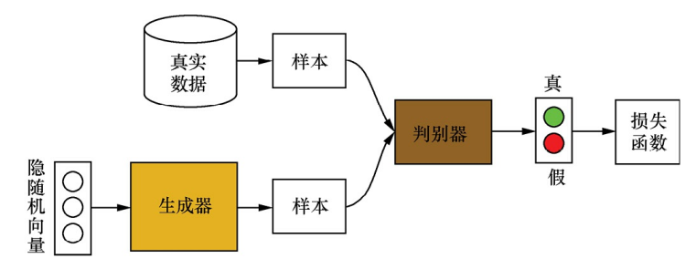

# 初始GANs
## 简述GANs的基本思想和训练过程

- 生成器通过调节自身参数，使得其生成的样本尽量难以被判别器识别出是真实样本还是模拟样本
- 判别器通过调节自身参数，以尽可能准确判别输入样本的来源。
- 训练判别器时，先固定生成器，然后利用生成器随机模拟产生样本$G(z)$作为负样本，真实样本作为正样本，利用判别误差更新判别器
- 训练生成器时，先固定判别器，利用生成器随机模拟产生样本，再输入到判别器中(仅输入负样本)。根据判别器的输出来计算误差。并更新生成器。

## GANs的值函数 (Value function)
- 二分类损失函数，$D(x)$表示判别器预测x为真实样本的概率，$p_{data}(x)$和$p_g(x)$分别表示从真实数据集和生成器得到x的概率:
  $$L(D)=-\frac{1}{2}\left(\mathbb{E}_{x\sim p_{data}(x)}[\log D(x)]+\mathbb{E}_{x\sim p_g(x)}[\log (1-D(x))]\right)$$
- 值函数，类似损失函数，只是需要最大化，
  $$V(G,D)=\mathbb{E}_{x\sim p_{data}(x)}[\log D(x)]+\mathbb{E}_{x\sim p_g(x)}[\log (1-D(x))]$$
- 整个MinMax游戏可以表示为$\min_G\max_D V(G,D)$

## GANs在实际训练中会遇到什么问题
- 实际训练中，早期阶段生成器$G(z,\theta)$会很差，生成的模拟样本很容易被判别器D识别,即$D(G(z,\theta))\rightarrow0$
- 设$D(x)=\sigma(o(x))$,$o(x)$为Sigmoid层的输入。则
  $$\nabla_\theta D(x)=\nabla sigmoid(o(x))=\frac{\partial sigmoid(o(x))}{\partial o(x)}\frac{\partial o(x)}{\partial \theta}\\=D(x)(1-D(x))\nabla_\theta o(x)$$
- 如果使用cross entropy loss训练$G$(训练G时只有负样本)，则梯度为：
  $$\nabla_\theta\log(1-D(G(z,\theta)))=\frac{-1}{1-D(G(z,\theta))}D(G(z,\theta))(1-D(G(z,\theta)))\nabla_\theta o(G(z,\theta))\\=-D(G(z,\theta))\nabla_\theta o(G(z,\theta))$$
  $$\lim_{D(G(z,\theta))\rightarrow0}\nabla_\theta\log(1-D(G(z,\theta)))=0$$
- 即$G$获得的梯度基本为0，达不到训练目的，该现象称为**优化饱和**
- 解决方法是将目标函数改为最大化$\log(D(G(z,\theta))$，此时：
  $$\nabla_\theta\log(D(G(z,\theta)))=(1-D(G(z,\theta)))\nabla_\theta o(G(z,\theta))$$
  $$\lim_{D(G(z,\theta))\rightarrow0}\nabla_\theta\log(D(G(z,\theta)))=\nabla_\theta o(G(z,\theta))$$

# WGAN
- 坍缩模式：生成器不稳定，坍缩模式是指反复生成一些相近或相同的图片，多样性太差。生成器似乎将图片记下，没有泛化。
- 原因：